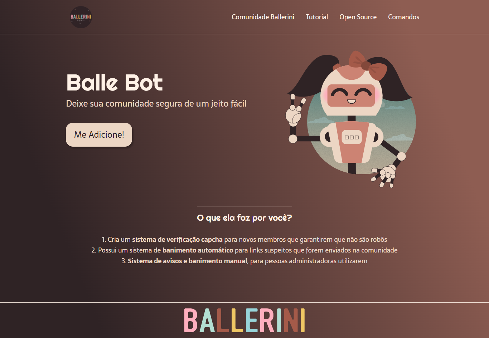

# Landing Page - Balle Bot

> Esse projeto, trata-se de uma landing page para um bot de uma comunidade do discord, o designer é da Rafaela Ballerini, porém diferente da versão dela, esse contém uma estrutura html e css própia e visamos o mobile first.

## :camera_flash: Imagem da Landing Page

## :hammer_and_wrench: Tecnologias utilizadas
 Foram utilizadas as segintes ferramentas no desenvolvimento:
 - HTML
 - CSS
 - JS
 - Protótipo :link: [Figma](https://www.figma.com/file/myqP66iQwzjwjrIAJyyrip/BalleBot?node-id=2%3A2)

## :nerd_face: Aprendizados
O que eu aprendi e coloquei em prática, com o desenvolvimento dessa landing page:
 - Divisão do html (header, nav, main e footer);
 - Utilização de fontes externas (Righteous e Sarala);
 - Hover no button;
 - First-Mobile.

## :page_facing_up: Requisitos
- Qualquer sistema operacional;
- Editor de texto :link: [VS Code](https://code.visualstudio.com/)
- Extensão para o VS Code :link: [Live Server](https://marketplace.visualstudio.com/items?itemName=ritwickdey.LiveServer)
- Browser :link: [Chrome](https://www.google.pt/intl/pt-PT/chrome/?brand=ISCS&gclid=CjwKCAiAtouOBhA6EiwA2nLKHzAVeY7vzxHKqYQHR9e2iF4Q-UYwVeNg_5CdIuPOs6RF2hbwjslc8xoCK3QQAvD_BwE&gclsrc=aw.ds)

## :pencil: Licença
Livre para uso e alteração